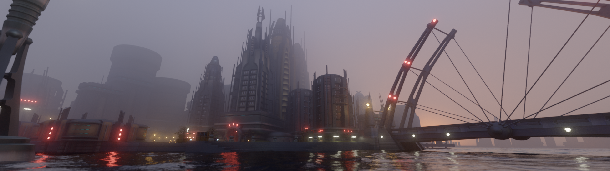
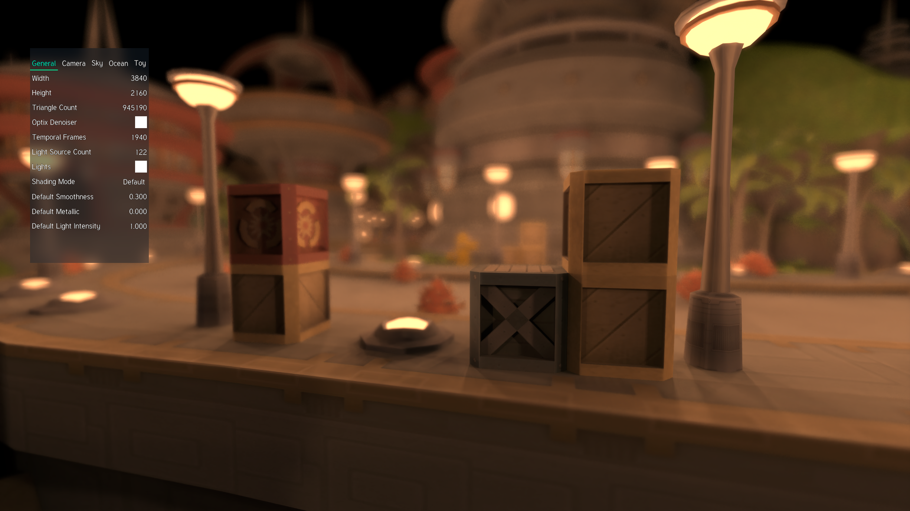

<p align="center">
  <h1><p align="center" style="font-weight: bold;">Luminary</p></h1>
  <p align="center">
   Offline Toy Renderer made with CUDA
    </p>
</p>
<p align="center">
  <a href="#about">About</a> •
  <a href="#usage">Usage</a> •
  <a href="#building">Building</a> •
  <a href="#licences">Licences</a> •
  <a href="#literature">Literature</a>
</p>

<p align="center">
  
</p>

<p align="center">
  
</p>

<p align="center">
  
</p>

<p align="center">
  
</p>

_Assets exported using [Replanetizer](https://github.com/RatchetModding/Replanetizer)._

# About

>📝 Luminary underwent a major host side rework recently and features might be missing or faulty. The latest stable commit is [`3068682
`](https://github.com/MilchRatchet/Luminary/commit/306868268a3e74995416baa6ff3f33876190d210).

The goal is to build an offline renderer that achieves high quality final renders in the lowest possible render time.

`Luminary` does not aim to be a production-ready renderer, instead, the feature set is kept small and only a small range of hardware is supported. There is in general no backwards compatibility with older scenes, if the renderer changes then so does the render of the scene. The focus is on a non-artist friendly user interface.

# Usage

>📝 Luminary currently transitions to a new scene description format, this new format is not yet available. Luminary can still parse the old format but it can no longer export scenes in the old format.

The scene is described through the Luminary Scene Description format (`*.lum`). The format is documented in the [Luminary File Documentations](LumFileDocs.md). It is possible to specify a `*.obj` file instead of a `*.lum` file. This will load the mesh and use the default settings. Then one can make changes to the settings and automatically generate a `*.lum` file.

Luminary comes with its own frontend called `Mandarin Duck`. You can run Mandarin Duck through:

```
LuminaryMD [File] [Args...]
```

where `File` is a relative or absolute path to a `*.obj` or `*.lum` file and Args is optionally one or more of:

```
-b, --benchmark [Log2 of Sample Count, Name of Benchmark Run]
        render the given scene and output an image at each power of two sample count up to the given target sample count

-h, --help
        print all available arguments

-o, --output [Path]
        Specify the output path to which renders are stored

-v, --version
        print build information and exit
```

# Building

Requirements:
- CUDA Toolkit 12.6
- Optix 8.0 SDK
- SDL3 and SDL3_ttf
- Modern CMake
- Make or Ninja
- AVX2 compatible CPU
- Supported Nvidia GPU (Pascal or later)

>📝 `zlib`, `qoi` and `Ceb` come as git submodules. Make sure to clone the submodules by using `git submodule update --init` after cloning Luminary.

## CMake Options
| Option                     | Description
| ------------------------------ | --------------------------------------------
| -DDEBUG=ON/OFF                 | Enable Debug Mode. Default: OFF
| -DNATIVE_CUDA_ARCH=ON/OFF      | Enable that the CUDA architecture is based on the installed GPU. Default: ON
| -DSHOW_KERNEL_STATS=ON/OFF     | Enable that CUDA kernel stats are printed at compilation. Default: OFF
| -DLUMINARY_MEMORY_DEBUG=ON/OFF | Enable tracking of all host side allocations. Default: OFF


## Windows

Additional requirements:
- MSVC 14.40 or later
- Windows SDK
- clang-cl

All these dependencies come with Visual Studio. However, if at some point it is possible to get them standalone, that would probably also suffice. Note that the paths to the CUDA Toolkit, OptiX, SDL3 and SDL3_ttf must be defined in the PATH environment variable, otherwise they need to be defined in CMake using `-D{PACKAGENAME}_ROOT="{PATH}"`.

Regarding MSVC and Windows SDK paths, there are two possibilities:

__Option 1__:
```
call "{VS Path}/VC/Auxiliary/Build/vcvarsall.bat" amd64
```
This sets the environment variables containing all the paths in this terminal instance.

__Option 2__: Add the paths of the binaries to the PATH environment variable, they look something like that:
```
{VS Path}/VC/Tools/MSVC/{Version}/bin/Hostx64/x64
{Windows SDK Path}/10/bin/{Version}/x64
```
Additionally, you need to pass the path to the libraries to cmake, the paths look like this:
```
{VS Path}/VC/Tools/MSVC/{Version}/lib/x64
{Windows SDK Path}/10/Lib/{Version}
```

You can build using the following commands in the main project directory:
```
mkdir build
call "{VS Path}/VC/Auxiliary/Build/vcvarsall.bat" amd64
cmake -B ./build -S . -G Ninja -DCMAKE_C_COMPILER=clang-cl
cd build && ninja
```
or alternatively:
```
mkdir build
cmake -B ./build -S . -G Ninja -DCMAKE_C_COMPILER=clang-cl -DWIN_LIB_DIR="{Windows SDK Path}/10/Lib/{Version}" -DMSVC_LIB_DIR="{VS Path}/VC/Tools/MSVC/{Version}/lib/x64"
cd build && ninja
```

Notes:
- It is important to use `clang-cl.exe` as the C compiler.
- If you use the first option, run `vcvarsall.bat` only once per terminal.

>📝 This is all only necessary because CUDA only supports MSVC as a host compiler on Windows. If this changes in the future then the Windows build will look similar to the Linux build.

## Linux

>📝 Linux support is not actively maintained, it may just not build.

You need a `nvcc` compatible host compiler. Which compilers are supported can be found in the [CUDA Installation Guide](https://docs.nvidia.com/cuda/cuda-installation-guide-linux/index.html#system-requirements). In general, any modern GCC, ICC or clang will work. By default, `nvcc` uses `gcc`/`g++`.

```
mkdir build
cmake -B ./build -S .
cd build
make
```
If `cmake` fails to find some packages you will have to specify the directory. For this look at the `Windows` section.

# Licence

Luminary and MandarinDuck are licensed under the terms of the **AGPL v.3** (GNU Affero General Public Licence). You can find the entire licence in the `LICENCE` file.

The default font provided by `Luminary` is the font `Tuffy` by Ulrich Thatcher which he placed in the `Public Domain`.

# Literature

This is a list of papers I have used for this project so far. Note that some techniques presented in these papers are not implemented at the moment but their ideas were helpful nonetheless:

- T. Möller, B. Trumbore, _Fast, Minimum Storage Ray-Triangle Intersection_, Journal of Graphics Tools, 2, pp. 21-28, 1997.
- A. Majercik, C. Crassin, P. Shirley, M. McGuire, _A Ray-Box Intersection Algorithm and Efficient Dynamic Voxel Rendering_, Journal of Computer Graphics Techniques, 7(3), pp. 66-82, 2018
- K. Booth, J. MacDonald, _Heuristics for ray tracing using space subdivision_, The Visual Computer, 6, pp. 153-166, 1990.
- T. Karras, S. Laine, H. Ylitie, _Efficient Incoherent Ray Traversal on GPUs Through Compressed Wide BVHs_, HPG '17: Proceedings of High Performance Graphics, pp. 1-13, 2017.
- J. Boksansky, _Crash Course in BRDF Implementation_, https://boksajak.github.io/blog/BRDF, 2021.
- S. Lagarde, C. de Rousiers, _Moving Frostbite to Physically Based Rendering_, 2014.
- A. Dietrich, H. Friedrich and M. Stich, _Spatial splits in bounding volume hierarchies_, HPG '09: Proceedings of the Conference on High Performance Graphics 2009, pp. 7-13, 2009.
- E. Haines, T. Akenine-Möller, "Ray Tracing Gems", Apress, 2019.
- J. Jimenez, _Next Generation Post Processing in Call of Duty: Advanced Warfare_, SIGGRAPH 2014.
- A. Marrs, P. Shirley and I. Wald, "Ray Tracing Gems II", Apress, 2021.
- A. Kirk and J. O'Brien, _Perceptually Based Tone Mapping for Low-Light Conditions_, ACM Transactions on Graphics, 30(4), pp. 1-10, 2011.
- J. Patry, _Real-Time Samurai Cinema: Lighting, Atmosphere, and Tonemapping in Ghost of Tsushima_, SIGGRAPH 2021.
- S. Hillaire, _Physically Based Sky, Atmosphere & Cloud Rendering in Frostbite_, SIGGRAPH 2016.
- S. Hillaire, _A Scalable and Production Ready Sky and Atmosphere Rendering Technique_, Computer Graphics Forum, 39(4), pp. 13-22, 2020.
- A. Wilkie, P. Vevoda, T. Bashford-Rogers, L. Hosek, T. Iser, M. Kolarova, T. Rittig and J. Krivanek, _A Fitted Radiance and Attenuation Model for Realistic Atmospheres_, Association for Computing Machinery, 40 (4), pp. 1-14, 2021.
- E. Bruneton, _A Qualitative and Quantitative Evaluation of 8 Clear Sky Models_, IEEE Transactions on Visualization and Computer Graphics, 23, pp. 2641–2655, 2016.
- E. Bruneton, _Precomputed Atmospheric Scattering_, 2017. URL: https://github.com/ebruneton/precomputed_atmospheric_scattering
- A. Schneider, _The Real-time Volumetric Cloudscapes of Horizon: Zero Dawn_, SIGGRAPH 2015.
- A. Schneider, _Nubis, Evolved: Real-Time Volumetric Clouds for Skies, Environments, and VFX_, SIGGRAPH 2022.
- B. Bitterli, C. Wyman, M. Pharr, P. Shirley, A. Lefohn, W. Jarosz, _Spatiotemporal reservoir resampling for real-time ray tracing with dynamic direct lighting_, ACM Transactions on Graphics (Proceedings of SIGGRAPH), 39(4), 2020.
- C. Wyman, A. Panteleev, "Rearchitecting Spatiotemporal Resampling for Production", High-Performance Graphics - Symposium Papers, pp. 23-41, 2021.
- T. Duff, J. Burgess, P. Christensen, C. Hery, A. Kensler, M. Liani, R. Villemin, _Building an Orthonormal Basis, Revisited_, Journal of Computer Graphics Techniques, 6(1), pp. 1-8, 2017.
- B. Widynski, _Squares: A Fast Counter-Based RNG_, arXiv preprint, 2020. URL: https://arxiv.org/abs/2004.06278
- J. Dupuy, A. Benyoub, _Sampling Visible GGX Normals with Spherical Caps_, 2023. arXiv:2306.05044
- J. Jendersie and E. d'Eon, _An Approximate Mie Scattering Function for Fog and Cloud Rendering_, SIGGRAPH 2023 Talks, 2023.
- M. Droske, J. Hanika, J. Vorba, A. Weidlich, M. Sabbadin, _Path Tracing in Production: The Path of Water_, ACM SIGGRAPH 2023 Courses, 2023.
- L. Belcour and E. Heitz, _Lessons Learned and Improvements when Building Screen-Space Samplers with Blue-Noise Error Distribution_, ACM SIGGRAPH 2021 Talks, pp. 1-2, 2021.
- K. Eto, Y. Tokuyoshi, _Bounded VNDF Sampling for Smith–GGX Reflections_, ACM SIGGRAPH Asia 2023 Technical Communications, pp. 1-4, 2023.
- D. Sforza, F. Pellacini, _Enforcing Energy Preservation in Microfacet Models_, Smart Tools and Applications in Graphics - Eurographics Italian Chapter Conference, 2022.
- R. West, I. Georgiev, T. Hachisuka, _Marginal Multiple Importance Sampling_, SIGGRAPH Asia 2022 Conference Papers, 2022.
- B. Walter, S. R. Marschner, H. Li, K. E. Torrance, _Microfacet models for refraction through rough surfaces_, Proceedings of the 18th Eurographics Conference on Rendering Techniques, pp. 195-206, 2007.
- A. C. Estevez, C. Kulla, _Importance Sampling of Many Lights with Adaptive Tree Splitting_, Proceedings of the ACM on Computer Graphics and Interactive Techniques, 1(2), pp. 1-17, 2018.
- A. C. Estevez, P. Lecocq, C. Hellmuth, _A Resampled Tree for Many Lights Rendering_, ACM SIGGRAPH 2024 Talks, 2024.
- V. Schüßler, J. Hanika, C. Dachsbacher, _Bridge Sampling for Connections via Multiple Scattering Events_, Computer Graphics Forum Proceedings of Eurographics Symposium on Rendering, 43(4), 2024.
- J. Buisine, S. Delepoulle, C. Renaud, _Firefly Removal in Monte Carlo Rendering with Adaptive Median of meaNs_, Eurographics Symposium on Rendering, 2021.
- B. Burley, _Practical Hash-based Owen Scrambling_, Journal of Computer Graphics Techniques (JCGT), pp. 1-20, 2020.
- A. G. M. Ahmed, _An Implementation Algorithm of 2D Sobol Sequence Fast, Elegant, and Compact_, Eurographics Symposium on Rendering, 2024.
