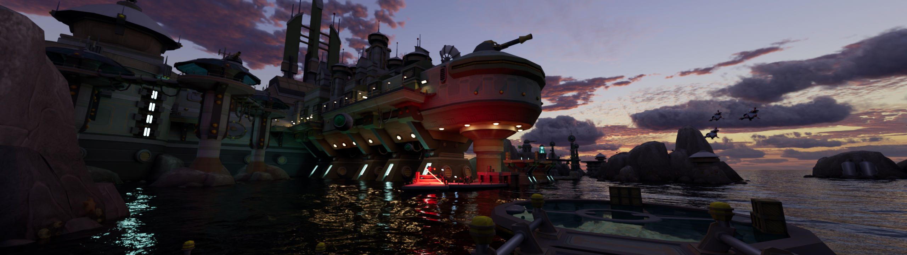
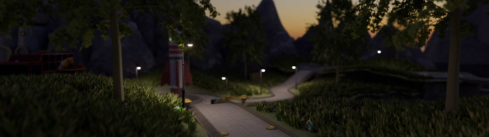
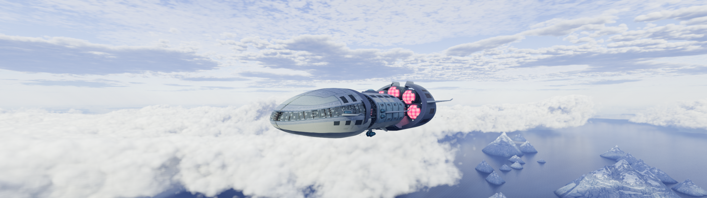
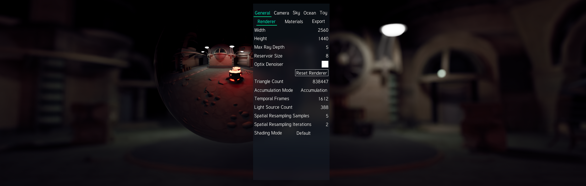

<p align="center">
  <h1><p align="center" style="font-weight: bold;">Luminary</p></h1>
  <p align="center">
    CUDA Pathtracing Renderer
    </p>
</p>
<p align="center">
  <a href="#about">About</a> •
  <a href="#usage">Usage</a> •
  <a href="#building">Building</a> •
  <a href="#licences">Licences</a> •
  <a href="#literature">Literature</a>
</p>

<p align="center">
  
</p>

<p align="center">
  
</p>

<p align="center">
  
</p>

# About

Luminary is a renderer using pathtracing. It aims at rendering high quality images while maintaining usable performance in realtime mode. Usage is supposed to be non-artist friendly, that is, the input consists of only meshes with albedo, material, illuminance and normal textures. All other effects come parameterized.

This project is for fun and to learn more about `real-time rendering`. Current plans can be found in the `Issues` tab.

The goal is to use as few libraries as feasible. Currently, the following libraries are used: `SDL2`, `zlib`, `qoi`, `OptiX` and `Ceb`.

Meshes and textures in the example images are taken from the Ratchet and Clank HD Trilogy and were exported using [Replanetizer](https://github.com/RatchetModding/Replanetizer).

# Usage

The scene is described through the Luminary Scene Description format (`*.lum`). The format is documented in the [Luminary File Documentations](LumFileDocs.md). It is possible to specify a `*.obj` file instead of a `*.lum` file. This will load the mesh and use the default settings. Then one can make changes to the settings and automatically generate a `*.lum` file. Alternatively, one can generate a `*.baked` file that contains all the necessary data in one file. The advantage is that loading from a `*.baked` file is fast, however, the file can be large.

You can start as:

```
Luminary [File] [Option]
```

where `File` is a relative or absolute path to a `*.obj`, `*.lum` or `*.baked` file and Option is one or more of:

```
-o, --offline
        start in offline mode, which renders one image using the specified settings

-t, --timings
        print execution times of some CPU functions

-l, --logs
        write a log file at the end of execution

-s, --samples
        set custom sample count for offline rendering (overrides value set by input file)

-w, --width
        set custom width (overrides value set by input file)

-h, --height
        set custom height (overrides value set by input file)

-p, --post-menu
        open post process menu after rendering an image in offline mode

-u, --unittest
        run a test suite, no rendering is done

-v, --version
        print build information and exit

    --force-displacement
        turn on displacement map usage on Ampere and Turing architecture GPUs

    --no-omm
        turn off opacity micromap usage

    --qoi
        set output image format to QOI

    --png
        set output image format to PNG
```

## Realtime Mode

<p align="center">
  
</p>

In realtime mode, which is used by default, you can control the camera through `WASD`, `LCTRL`, `SPACE` and the mouse. The sun can be controlled with the arrow keys. A snapshot can be made by pressing `[F12]`. You can open a user interface with `[E]` in which you can change most parameters.

>📝 In a UI panel, if the number is colored when hovering, you can change the value by holding the left mouse button and moving the mouse left/right.

# Building

Requirements:
- CUDA Toolkit 12.1
- Optix 8.0 SDK
- SDL2 and SDL2_ttf
- Modern CMake
- Make or Ninja
- SSE 4.1 compatible CPU
- Supported Nvidia GPU (Pascal or later)

>📝 The use of opacity micromaps and displacement micromaps at the same time is only possible on Ada Lovelace Arch GPUs. (This seems to not be documented anywhere.)

`zlib` comes as a submodule and is compiled with Luminary, it is not required to have `zlib` installed. This is due to the compiler limitations of CUDA on Windows which makes usage of zlib-ng inconvenient.
>📝 `zlib` and `qoi` come as git submodules. Make sure to clone the submodules by using `git submodule update --init` after cloning Luminary.

## CMake Options
| Option                     | Description
| ------------------------------| --------------------------------------------
| -DDEBUG=ON/OFF                | Enable Debug Mode. Default: OFF
| -DNATIVE_CUDA_ARCH=ON/OFF     | Enable that the CUDA architecture is based on the installed GPU. Default: ON
| -DSHOW_KERNEL_STATS=ON/OFF    | Enable that CUDA kernel stats are printed at compilation. Default: OFF

## Linux

You need a `nvcc` compatible host compiler. Which compilers are supported can be found in the [CUDA Installation Guide](https://docs.nvidia.com/cuda/cuda-installation-guide-linux/index.html#system-requirements). In general, any modern GCC, ICC or clang will work. By default, `nvcc` uses `gcc`/`g++`.

```
mkdir build
cmake -B ./build -S .
cd build
make
```
If `cmake` fails to find some packages you will have to specify the directory. For this look at the `Windows` section.

## Windows

Additional requirements:
- MSVC
- Windows SDK
- clang-cl

Clang-cl comes for example with mingw-w64 or Visual Studio. MSVC and Windows SDK come with Visual Studio. However, if at some point it is possible to get them standalone, that would probably also suffice. Note that the paths to the CUDA Toolkit, OptiX, SDL2 and SDL2_ttf must be defined in the PATH environment variable, otherwise they need to be defined in CMake using `-D{PACKAGENAME}_ROOT="{PATH}"`.

Regarding MSVC and Windows SDK paths, there are two possibilities:

__Option 1__:
```
call "{VS Path}/VC/Auxiliary/Build/vcvarsall.bat" amd64
```
This sets the environment variables containing all the paths in this terminal instance.

__Option 2__: Add the paths of the binaries to the PATH environment variable, they look something like that:
```
{VS Path}/VC/Tools/MSVC/{Version}/bin/Hostx64/x64
{Windows SDK Path}/10/bin/{Version}/x64
```
Additionally, you need to pass the path to the libraries to cmake, the paths look like this:
```
{VS Path}/VC/Tools/MSVC/{Version}/lib/x64
{Windows SDK Path}/10/Lib/{Version}
```

__Regarding SDL2__: You need to download SDL2_devel and SDL2_ttf_devel for VC, these are for example available on Github.

You can build using the following commands in the main project directory:
```
mkdir build
call "{VS Path}/VC/Auxiliary/Build/vcvarsall.bat" amd64
cmake -B ./build -S . -G Ninja -DCMAKE_C_COMPILER="{Path}/clang-cl.exe"
cd build && ninja
```
or alternatively:
```
mkdir build
cmake -B ./build -S . -G Ninja -DCMAKE_C_COMPILER="{Path}/clang-cl.exe" -DWIN_LIB_DIR="{Windows SDK Path}/10/Lib/10.0.19041.0" -DMSVC_LIB_DIR="{VS Path}/VC/Tools/MSVC/{Version}/lib/x64"
cd build && ninja
```

Notes:
- It is important to use either `clang-cl.exe` or `cl.exe` as the C compiler.
- If you use the first option, run `vcvarsall.bat` only once per terminal.
- `SDL2.dll` and `SDL2_ttf.dll` are automatically copied into the build dir and always need to reside in the same directory as `Luminary.exe`.

>📝 This is all only necessary because CUDA only supports MSVC as a host compiler on Windows. If this changes in the future then the Windows build will look similar to the Linux build.

# Licences

The licence for this code can be found in the `LICENCE` file.

The default font provided by `Luminary` is the font `Tuffy` by Ulrich Thatcher which he placed in the `Public Domain`.

# Literature

This is a list of papers I have used for this project so far. Note that some techniques presented in these papers are not implemented at the moment but their ideas were helpful nonetheless:

- T. Möller, B. Trumbore, _Fast, Minimum Storage Ray-Triangle Intersection_, Journal of Graphics Tools, 2, pp. 21-28, 1997.
- A. Majercik, C. Crassin, P. Shirley, M. McGuire, _A Ray-Box Intersection Algorithm and Efficient Dynamic Voxel Rendering_, Journal of Computer Graphics Techniques, 7(3), pp. 66-82, 2018
- K. Booth, J. MacDonald, _Heuristics for ray tracing using space subdivision_, The Visual Computer, 6, pp. 153-166, 1990.
- T. Karras, S. Laine, H. Ylitie, _Efficient Incoherent Ray Traversal on GPUs Through Compressed Wide BVHs_, HPG '17: Proceedings of High Performance Graphics, pp. 1-13, 2017.
- J. Boksansky, _Crash Course in BRDF Implementation_, https://boksajak.github.io/blog/BRDF, 2021.
- S. Lagarde, C. de Rousiers, _Moving Frostbite to Physically Based Rendering_, 2014.
- A. Dietrich, H. Friedrich and M. Stich, _Spatial splits in bounding volume hierarchies_, HPG '09: Proceedings of the Conference on High Performance Graphics 2009, pp. 7-13, 2009.
- E. Haines, T. Akenine-Möller, "Ray Tracing Gems", Apress, 2019.
- J. Jimenez, _Next Generation Post Processing in Call of Duty: Advanced Warfare_, SIGGRAPH 2014.
- A. Marrs, P. Shirley and I. Wald, "Ray Tracing Gems II", Apress, 2021.
- A. Kirk and J. O'Brien, _Perceptually Based Tone Mapping for Low-Light Conditions_, ACM Transactions on Graphics, 30(4), pp. 1-10, 2011.
- J. Patry, _Real-Time Samurai Cinema: Lighting, Atmosphere, and Tonemapping in Ghost of Tsushima_, SIGGRAPH 2021.
- S. Hillaire, _Physically Based Sky, Atmosphere & Cloud Rendering in Frostbite_, SIGGRAPH 2016.
- S. Hillaire, _A Scalable and Production Ready Sky and Atmosphere Rendering Technique_, Computer Graphics Forum, 39(4), pp. 13-22, 2020.
- A. Wilkie, P. Vevoda, T. Bashford-Rogers, L. Hosek, T. Iser, M. Kolarova, T. Rittig and J. Krivanek, _A Fitted Radiance and Attenuation Model for Realistic Atmospheres_, Association for Computing Machinery, 40 (4), pp. 1-14, 2021.
- E. Bruneton, _A Qualitative and Quantitative Evaluation of 8 Clear Sky Models_, IEEE Transactions on Visualization and Computer Graphics, 23, pp. 2641–2655, 2016.
- E. Bruneton, _Precomputed Atmospheric Scattering_, 2017. URL: https://github.com/ebruneton/precomputed_atmospheric_scattering
- A. Schneider, _The Real-time Volumetric Cloudscapes of Horizon: Zero Dawn_, SIGGRAPH 2015.
- A. Schneider, _Nubis, Evolved: Real-Time Volumetric Clouds for Skies, Environments, and VFX_, SIGGRAPH 2022.
- C. Fdez-Agüera, _A Multiple-Scattering Microfacet Model for Real-Time Image Based Lighting_, Journal of Computer Graphics Techniques (JCGT), 8(1), pp. 45-55, 2019.
- B. Bitterli, C. Wyman, M. Pharr, P. Shirley, A. Lefohn, W. Jarosz, _Spatiotemporal reservoir resampling for real-time ray tracing with dynamic direct lighting_, ACM Transactions on Graphics (Proceedings of SIGGRAPH), 39(4), 2020.
- C. Wyman, A. Panteleev, "Rearchitecting Spatiotemporal Resampling for Production", High-Performance Graphics - Symposium Papers, pp. 23-41, 2021.
- T. Duff, J. Burgess, P. Christensen, C. Hery, A. Kensler, M. Liani, R. Villemin, _Building an Orthonormal Basis, Revisited_, Journal of Computer Graphics Techniques, 6(1), pp. 1-8, 2017.
- B. Widynski, _Squares: A Fast Counter-Based RNG_, arXiv preprint, 2020. URL: https://arxiv.org/abs/2004.06278
- J. Dupuy, A. Benyoub, _Sampling Visible GGX Normals with Spherical Caps_, 2023. arXiv:2306.05044
- J. Jendersie and E. d'Eon, _An Approximate Mie Scattering Function for Fog and Cloud Rendering_, SIGGRAPH 2023 Talks, 2023.
- M. Droske, J. Hanika, J. Vorba, A. Weidlich, M. Sabbadin, _Path Tracing in Production: The Path of Water_, ACM SIGGRAPH 2023 Courses, 2023.
