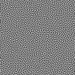

Bluenoise textures made available by [Cristoph Peters](http://momentsingraphics.de/BlueNoise.html).

The 2D bluenoise mask was a grayscale-alpha image that I converted into an RGB image with a black blue layer.

  

  

