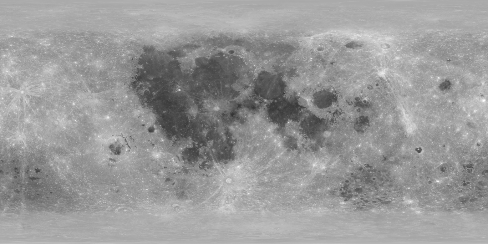
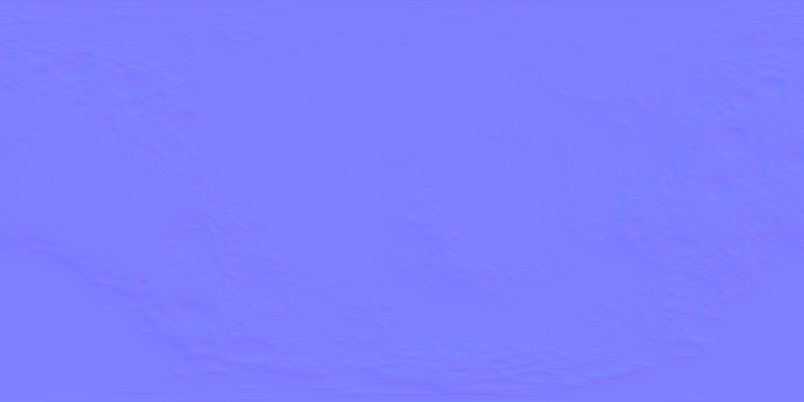

Moon textures made available by NASA's Scientific Visualization Studio ([NASA CGI Moon Kit](https://svs.gsfc.nasa.gov/cgi-bin/details.cgi?aid=4720)).

The textures were downscaled by a factor of 20 in each axis. The normal map was created using Materialize from the height map.

  

  

